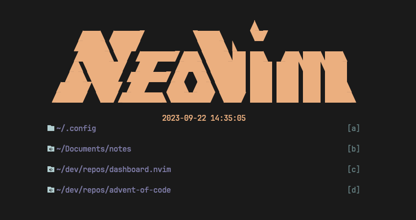

# Introduction

Neovim dashboard plugin


- Look at the [Options -> header](#header) section to get results like above

# Features

- Fully customizable header with reference for integrating with ascii art plugin
- Provide directories and this plugin will:
  - Display them on the dashboard
  - Make them accessible with single letter hotkey
- Input is ordered and hotkeys are generated sequentially, making for a
  consistent experience

# Install

## lazy.nvim

```lua
{
    'MeanderingProgrammer/dashboard.nvim',
    event = 'VimEnter',
    config = function()
        require('dashboard').setup({})
    end,
}
```

# Setup

The setups below show the default values, which if used will result in an empty screen.

It is recommended to provide `directories` at least, and a `header` for some fun.

```lua
require('dashboard').setup({
    -- Dashboard header
    header = {},
    -- Format to display date in
    date_format = nil,
    -- List of directory paths, or functions that return paths
    directories = {},
    -- Sections to add at bottom, these can be string references to
    -- functions in sections.lua, custom strings, or custom functions
    footer = {},
    -- Local options set on dashboard buffer
    options = {
        bufhidden = 'wipe',
        buflisted = false,
        cursorcolumn = false,
        cursorline = false,
        filetype = 'dashboard',
        number = false,
        relativenumber = false,
        spell = false,
        statuscolumn = '',
        swapfile = false,
        wrap = false,
    },
    -- Gets called after directory is changed and is provided with the
    -- directory path as an argument
    on_load = function(path)
        -- do nothing
    end,
    -- Highlight groups to use for various components
    highlight_groups = {
        header = 'Constant',
        icon = 'Type',
        directory = 'Delimiter',
        hotkey = 'Statement',
    },
})
```

# Options

## `header`

By default no header is provided by the plugin. As it is just an array of strings
you can create your own or use another plugin which provides the ascii art.

For example using [MaximilianLloyd/ascii.nvim](https://github.com/MaximilianLloyd/ascii.nvim)
in `lazy.nvim` to achieve the look in the screenshots:

```lua
{
    'MeanderingProgrammer/dashboard.nvim',
    event = 'VimEnter',
    dependencies = {
        { 'MaximilianLloyd/ascii.nvim', dependencies = { 'MunifTanjim/nui.nvim' } },
    },
    config = function()
        require('dashboard').setup({
            header = require('ascii').art.text.neovim.sharp,
            directories = {
                '~/.config',
                '~/Documents/notes',
                '~/dev/repos/harpoon-core.nvim',
                '~/dev/repos/dashboard.nvim',
                '~/dev/repos/advent-of-code',
            },
        })
    end,
}
```

Using this exact setup will result in the same Dashboard as the screenshot at the
top, assuming these are valid directories on your system.

You can also use methods provided by the ascii plugin to randomize the look on every
load, for example:

```lua
require('ascii').get_random_global()
```

## `date_format`

This will add the date right after the header in the format specified.

The date is static and will not be updated until the dashboard is reloaded.

This will build off of the `header` option so the difference in screenshots is
more clear.

```lua
{
    'MeanderingProgrammer/dashboard.nvim',
    event = 'VimEnter',
    dependencies = {
        { 'MaximilianLloyd/ascii.nvim', dependencies = { 'MunifTanjim/nui.nvim' } },
    },
    config = function()
        require('dashboard').setup({
            header = require('ascii').art.text.neovim.sharp,
            date_format = '%Y-%m-%d %H:%M:%S',
            directories = {
                '~/.config',
                '~/Documents/notes',
                '~/dev/repos/harpoon-core.nvim',
                '~/dev/repos/dashboard.nvim',
                '~/dev/repos/advent-of-code',
            },
        })
    end,
}
```



## `footer`

Resolving each value in the footer sections happens as follows:

- If the value is a string:
  - If `sections.lua` has a function with that name call that function and get
    the result. Valid values for this are `version` and `startuptime`.
  - Otherwise use the string value as it was provided.
- If the value is a function:
  - Call the function, get the result, and check that it is a string.
- Otherwise print an error message

# Acknowledgements

The popular [dashboard-nvim](https://github.com/nvimdev/dashboard-nvim) plugin was
used as a reference point in the development of this plugin. These plugins do very
different things other than sharing the concept of being a dashboard. In many ways
`dashboard-nvim` is better and has a lot of neat features but I was looking for
something more user defined as opposed to inferred.
